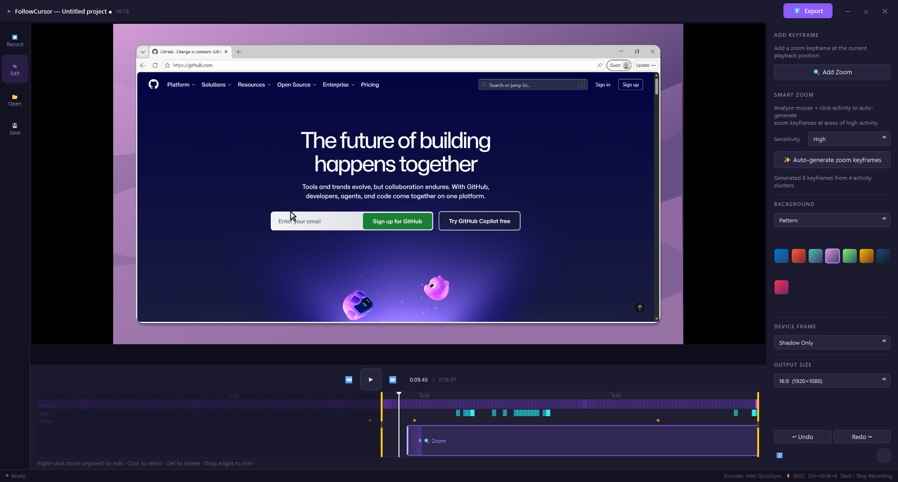

# FollowCursor

A Windows screen recorder with cinematic cursor-following zoom — built with **Python** and **PySide6 (Qt 6)**.

Record your screen or any individual window, then export a polished MP4 video where the camera smoothly follows and zooms into your cursor movements. Perfect for tutorials, demos, and product walkthroughs.

> **New here?** Jump to the [Quickstart Guide](docs/QUICKSTART.md) to get recording in under 5 minutes.

<https://github.com/user-attachments/assets/b2e8bb7e-2f8e-4668-ab63-c4e4fe0ec552>

## Documentation

| Document | Description |
| -------- | ----------- |
| [User Guide](docs/USER_GUIDE.md) | Complete feature reference — every feature explained |
| [Quickstart Guide](docs/QUICKSTART.md) | Install, record, edit, export — step by step |
| [Architecture Guide](docs/ARCHITECTURE.md) | How the codebase works: data flow, zoom engine, capture pipeline |
| [Contributing Guide](docs/CONTRIBUTING.md) | Dev setup, coding conventions, release process |

## Features



- **Screen & Window Recording** — Capture any monitor (hardware-accelerated via Windows Graphics Capture) or individual windows
- **Smart Auto-Zoom** — Automatically detects mouse settlements, typing bursts, and click clusters to generate zoom keyframes with configurable sensitivity (Low / Medium / High). Spatial-aware clustering merges nearby same-area events into sustained zooms, and consecutive clusters are chained together (up to 4 per chain) — the camera stays zoomed in and pans smoothly between them instead of zooming out and back in
- **Manual Zoom Keyframes** — Right-click the timeline or preview to add zoom points; drag segments to reposition them
- **Zoom Depth Control** — Right-click a zoom segment to set depth (Subtle 1.25×, Medium 1.5×, Close 2×, Detail 2.5×)
- **Centroid Editing** — Reposition the pan center of any zoom keyframe by clicking "Set centroid" on a zoom segment, then clicking the target point on the preview
- **Live Zoom Shortcuts** — `Ctrl+Shift+=` / `Ctrl+Shift+-` to zoom in/out during recording (global hotkeys)
- **Mouse & Click Tracking** — Records cursor position at 60 Hz, keyboard events, and click events with visual markers
- **Click Selection & Deletion** — Select individual click events on the timeline and delete unwanted ones
- **Timeline Editor** — Visual timeline with mouse-speed heatmap, gradient-styled zoom segments, draggable edges, and click-to-seek
- **Trimming** — Drag trim handles on the timeline edges to cut unwanted content from the start or end of your recording; export respects the trimmed range
- **Undo & Redo** — Full undo/redo for all zoom keyframe changes (Ctrl+Z / Ctrl+Shift+Z / Ctrl+Y), up to 50 levels deep
- **Cinematic Export** — H.264 MP4 via ffmpeg with ease-out easing, cursor rendering, click ripple effects, and device frame overlays. Supports GPU-accelerated encoding (NVENC, QuickSync, AMF) with automatic detection and fallback to software x264. Status bar shows active encoder name during export
- **Output Dimensions** — Choose from Auto, 16:9, 3:2, 4:3, 1:1, or 9:16 aspect ratios for the exported video. Preview shows crop boundaries with a semi-transparent overlay
- **Background Presets** — 84 backgrounds (39 solids + 37 gradients + 8 patterns) with category picker
- **Device Frames** — 5 frame styles: Wide Bezel, Slim Bezel, Thin Border, Shadow Only, No Frame
- **Project Files** — Save/load `.fcproj` bundles (ZIP with metadata + raw video) to resume editing later. Ctrl+S re-saves to the current file. Title bar shows project name and unsaved-changes indicator (●)
- **Close Confirmation** — Prompts to save unsaved changes before closing the app
- **Open in Clipchamp** — One-click handoff to Clipchamp for further editing
- **Debug Overlay** — Per-time zoom marker overlay on the preview for fine-tuning keyframes (toggle via ⚙ settings menu)
- **3-Second Countdown** — Visual countdown before recording starts
- **Frameless Dark UI** — Custom title bar, dark theme with purple accents

## Architecture

| Layer | Technology | Purpose |
| ----- | ---------- | ------- |
| UI Framework | PySide6 (Qt 6) | Widgets, layout, painting, signals/slots |
| Screen Capture | Windows Graphics Capture (WGC) | Hardware-accelerated monitor/window capture |
| Window Capture | Win32 PrintWindow (ctypes) | Per-window capture without bleed-through |
| Recording Pipe | ffmpeg via imageio-ffmpeg | Lossless intermediate AVI (huffyuv) piped via stdin |
| Video Export | ffmpeg (libx264 / HW accel) | H.264 MP4 encoding (CRF 18 equivalent) with zoom/cursor baked in; auto-detects NVENC, QuickSync, AMF |
| Image Processing | OpenCV + NumPy | Frame manipulation, thumbnails, cursor rendering |
| Input Tracking | Win32 Hooks (ctypes) | Low-level mouse, keyboard, and click tracking |
| Zoom Engine | Pure Python | Ease-out-eased keyframe interpolation |

## Getting Started

### Prerequisites

- **Windows 10/11**
- **Python 3.10+** — [Download](https://www.python.org/downloads/) (check "Add to PATH" during install)

### Quick Start

```bat
dev.bat
```

Creates a virtual environment, installs dependencies, and launches the app.

### Manual Setup

```bat
python -m venv .venv
.venv\Scripts\activate
pip install -r requirements.txt
python main.py
```

## Building

Build a standalone `.exe` with PyInstaller:

```bat
build.bat
```

Output: `dist\FollowCursor\FollowCursor.exe`

The build script automatically creates a virtual environment and installs all dependencies if needed.

## CI/CD

A GitHub Actions workflow (`.github/workflows/build.yml`) runs on every push/PR to `main`:

1. Sets up Python 3.13 on a Windows runner
2. Extracts the app version from `app/version.py`
3. Installs dependencies
4. Builds with PyInstaller
5. Uploads the versioned build artifact (retained 30 days)
6. Creates a GitHub Release when a version tag (`v*`) is pushed

You can also trigger a build manually from the Actions tab.

### Releasing a new version

1. Update `__version__` in `followcursor/app/version.py`
2. Commit and push to `main`
3. Tag the commit: `git tag v0.2.0 && git push --tags`
4. The CI workflow automatically creates a GitHub Release

## Shortcuts

| Shortcut | Action |
| -------- | ------ |
| `Space` | Play / pause playback (edit view) |
| `Z` | Insert zoom keyframe at playhead (edit view) |
| `Ctrl+Shift+=` | Zoom in at cursor position |
| `Ctrl+Shift+-` | Zoom out to 1.0× |
| `Ctrl+S` | Save project (re-saves to current file) |
| `Ctrl+Z` | Undo last zoom keyframe change |
| `Ctrl+Shift+Z` / `Ctrl+Y` | Redo last undone change |
| Right-click zoom segment | Edit depth / centroid / delete |
| Right-click preview | Add zoom at click position |
| Drag zoom segment edge | Reposition zoom in timeline |
| Left-click event dot | Select click event |
| `Delete` | Remove selected click event |
| Drag timeline edge handles | Set trim start/end point |

## Project Structure

```text
followcursor/
├── main.py                          # Entry point, QApplication setup
├── requirements.txt                 # Python dependencies
├── build.bat                        # PyInstaller build script
├── dev.bat                          # Dev setup & launch script
├── followcursor.ico                 # App icon
├── app/
│   ├── version.py                   # Semantic version (__version__)
│   ├── models.py                    # Data classes (MousePosition, ZoomKeyframe, ClickEvent, …)
│   ├── utils.py                     # Shared helpers (ffmpeg path, encoder detection, subprocess, time formatting)
│   ├── zoom_engine.py               # Ease-out keyframe interpolation
│   ├── mouse_tracker.py             # QTimer-based cursor polling (60 Hz)
│   ├── keyboard_tracker.py          # Win32 keyboard hook
│   ├── click_tracker.py             # Win32 mouse click hook
│   ├── activity_analyzer.py         # Auto-zoom from mouse/keyboard/click activity
│   ├── screen_recorder.py           # WGC + ffmpeg pipe in background thread
│   ├── window_utils.py              # Win32 window enumeration & PrintWindow
│   ├── video_exporter.py            # H.264 MP4 export with zoom & cursor
│   ├── compositor.py                # QPainter compositing (frame + background)
│   ├── cursor_renderer.py           # Arrow cursor + click ripple rendering
│   ├── global_hotkeys.py            # Win32 RegisterHotKey via QThread
│   ├── backgrounds.py               # 84 background presets (solids, gradients, patterns)
│   ├── frames.py                    # 5 device frame presets
│   ├── project_file.py              # .fcproj save/load (ZIP bundle)
│   ├── icon.py                      # QPainter-generated app icon
│   ├── theme.py                     # QSS dark theme stylesheet
│   ├── main_window.py               # Main window — assembles all widgets
│   └── widgets/
│       ├── title_bar.py             # Custom frameless title bar
│       ├── source_picker.py         # Screen/Window selection dialog (tabbed)
│       ├── preview_widget.py        # Live / playback preview with zoom/pan
│       ├── timeline_widget.py       # QPainter timeline with heatmap & keyframes
│       ├── editor_panel.py          # Zoom settings, background, frame, output pickers
│       ├── countdown_overlay.py     # 3-2-1 countdown animation
│       ├── processing_overlay.py    # Pulsing banner while finishing recording
│       └── recording_border.py      # Red border during recording
```
